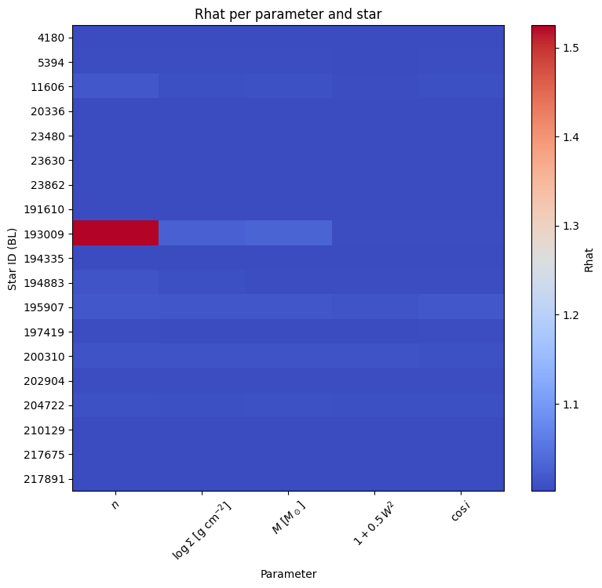
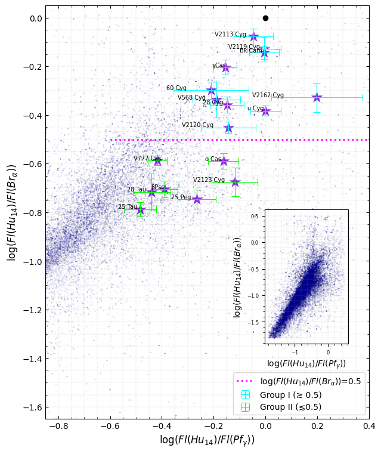
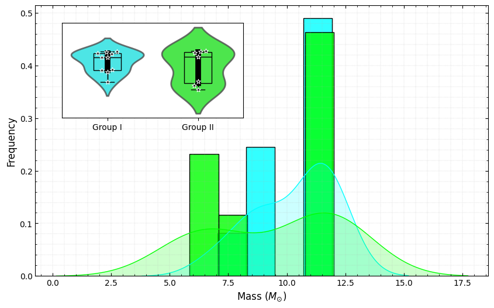
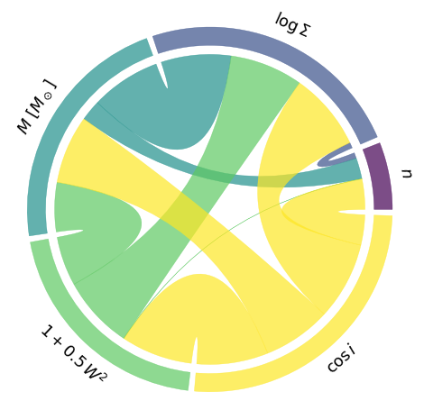

# BeAtlas – L-band and mid-infrared characterization of 21 Be stars

This repository contains the main code and figures used in the paper:

> **“The BeAtlas grid: L-band and mid-infrared characterization of 21 Be stars”**  
> F. A. Orjuela-Lopez, B. E. Sabogal-Martinez, L. R. Rímulo, A. C. Carciofi, & D. M. Faes

All disk models were computed with **HDUST**, and we performed **Bayesian inference** on each star to obtain the posterior distributions of the main disk and stellar parameters.

---

## Repository structure

- `Corner2025.ipynb`  
  MCMC analysis for the sample of 21 Be stars. Produces corner plots, convergence diagnostics, and the correlation matrices used in the chord diagram.

- `FractionBe.ipynb`  
  Post-processing of the posterior samples to estimate the fraction of Be stars as a function of stellar mass and other parameters.

- `LenorzerCorner.ipynb`  
  Produces the Lenorzer diagram (L-band line-ratio diagram) combining the BeAtlas grid with the observed sample, and links it to the inferred disk parameters.

- `.gitkeep`  
  Placeholder file to keep empty directories under version control.

All the figures shown below are generated directly from these notebooks.

---

## Main figures and scientific results

### 1. Convergence diagnostics (R̂ heatmap)



This heatmap shows the **Gelman–Rubin statistic R̂** for each parameter and each star:

- Parameters: \(n\), \(\log \Sigma\), \(M\), \(1+0.5W^2\), and \(\cos i\).
- Rows: individual Be stars (labeled by HD/BL number).

**Interpretation**

- Most cells are very close to **R̂ ≈ 1**, indicating **good convergence** of the MCMC chains for essentially all parameters and stars.
- A few parameters for HD 193009 (and marginally HD 191610) show **R̂ > 1.1**, signalling **slow mixing or residual non-convergence** for those particular posteriors.

**Implication**

The global result is that the **Bayesian inference is statistically robust** for the majority of the sample; only a couple of stars need special care (longer chains, different initialization, or re-parameterization) before using their posteriors in population-level analyses.

---

### 2. Lenorzer diagram – L-band line ratios and groups I/II



This panel shows the classical **Lenorzer L-band line-ratio diagram**:

- **Background cloud**: the synthetic BeAtlas grid (HDUST models) in the plane  
  \(\log(F(\mathrm{Hu\,14})/F(\mathrm{Pf}\,\gamma))\) vs. \(\log(F(\mathrm{Hu\,14})/F(\mathrm{Br}\,\alpha))\).
- **Stars with error bars**: the 21 observed Be stars, with their measured line ratios and uncertainties.
- **Magenta dashed line**: the empirical boundary  
  \(\log(F(\mathrm{Hu\,14})/F(\mathrm{Br}\,\alpha)) = 0.5\),
  used to separate **Group I** (above) and **Group II** (below).
- **Cyan markers**: Group I (high Hu14/Brα ratios).  
- **Green markers**: Group II (lower Hu14/Brα ratios).

**Interpretation**

- The observed stars lie **inside the region spanned by the BeAtlas grid**, meaning that the HDUST models provide a consistent description of the L-band line ratios.
- The empirical division at \(\log(F(\mathrm{Hu\,14})/F(\mathrm{Br}\,\alpha))=0.5\) clearly splits the sample into two groups with distinct L-band behaviour.

**Implication**

The Lenorzer diagram demonstrates that **Groups I and II correspond to physically different disk conditions** (optical depths, density structure, and viewing geometry) rather than to observational noise. These two regimes can be directly mapped onto the BeAtlas grid and then connected to the posterior distributions of the disk parameters obtained from the Bayesian analysis.

---

### 3. Stellar mass distribution for Groups I and II



This figure compares the **stellar mass distributions** of Group I and Group II:

- **Main panel**: overlaid histograms and KDE curves for the stellar masses (\(M_\star\)) of Group I (cyan) and Group II (green).
- **Inset**: violin + box + swarm plots for both groups, showing median, inter-quartile range, and individual stars.

**Interpretation**

- Both groups occupy **a very similar mass range**, from roughly \(6\,M_\odot\) to \(12\,M_\odot\).
- The median masses of Group I and Group II are **almost identical**, and the distributions strongly overlap.

**Implication**

The separation between **Group I and Group II is **not driven by stellar mass**.  
Therefore, the different L-band line-ratio behaviour must be linked to **disk properties** (density structure, optical depth, geometry) rather than to systematic differences in the underlying stellar mass distribution.

---

### 4. Posterior correlations between model parameters (chord diagram)



This chord diagram summarizes the **posterior correlations** between the main model parameters:

- Arcs: \(\log n\), \(\log \Sigma\), \(M\), \(1+0.5W^2\) (rotation), and \(\cos i\) (inclination).
- Cords: pairwise correlations; the **wider** the band, the **stronger** the (anti-)correlation.

**Interpretation**

- Strong correlation between **\(\cos i\)** and **\(1+0.5W^2\)** → inclination and rotation are highly degenerate: changing \(i\) can be partially compensated by changing \(W\) in the line profiles.
- Significant correlation between **\(\log \Sigma\)** and **\(M\)** (and to a lesser extent with \(W\)) → the absolute disk density scale is entangled with the stellar mass and rotation.
- Comparatively **weak links for \(\log n\)** → the radial density exponent is more “orthogonal” to the other parameters and is better constrained independently.

**Implication**

The chord diagram highlights where the **Bayesian inference is limited by physical degeneracies** in the HDUST model. It tells us that:

- \(n\) and, to some extent, \(W\) are **robustly measured**,  
- while \(\log \Sigma\), \(M\), and \(i\) can be affected by strong degeneracies.

This guides future modelling efforts: to break these degeneracies we need **additional observables** (e.g. multi-wavelength SED, polarimetry, interferometry) or more informative priors on \(M\) and \(i\).

---

## Reproducibility

All results presented here can be reproduced by running the notebooks in this repository:

1. Clone the repo:
   ```bash
   git clone https://github.com/<user>/BeAtlas-Lband-2025.git
   cd BeAtlas-Lband-2025
